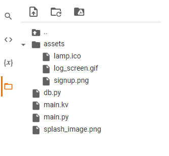
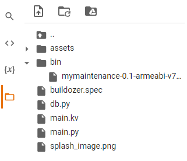
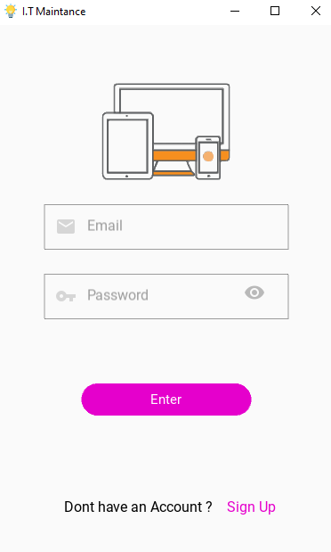
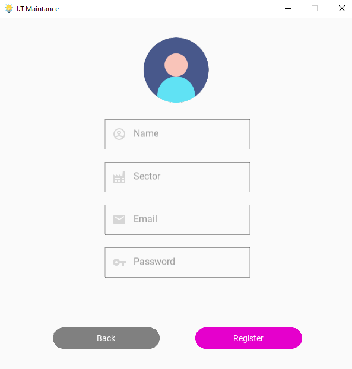
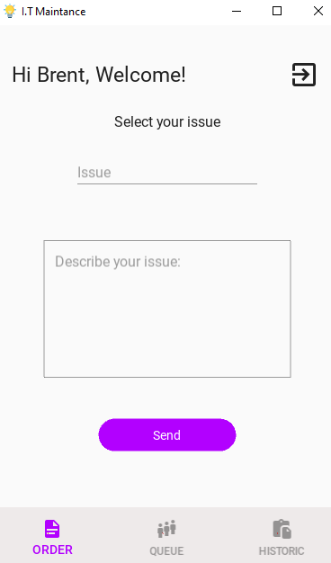
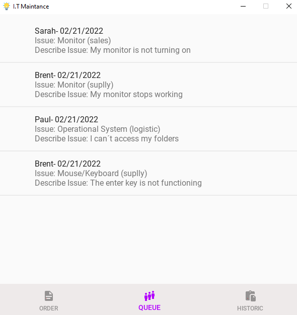
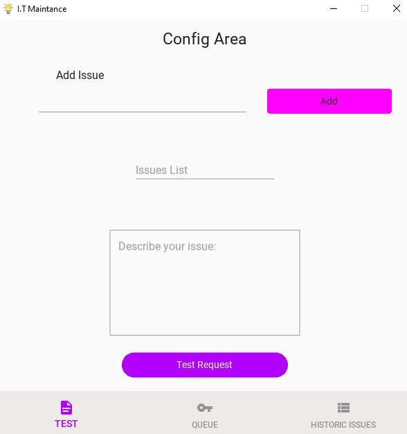
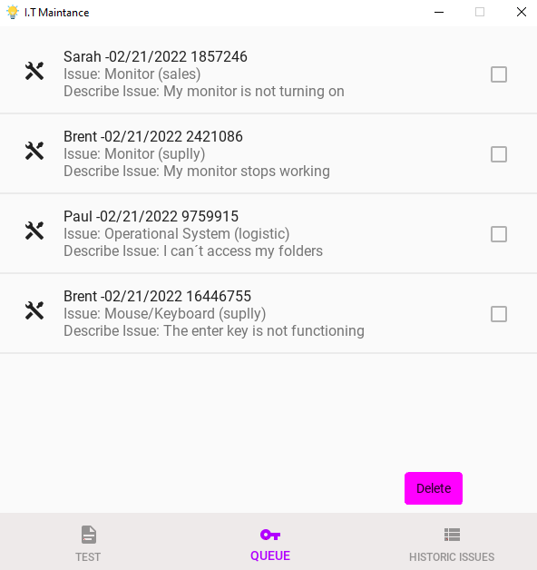
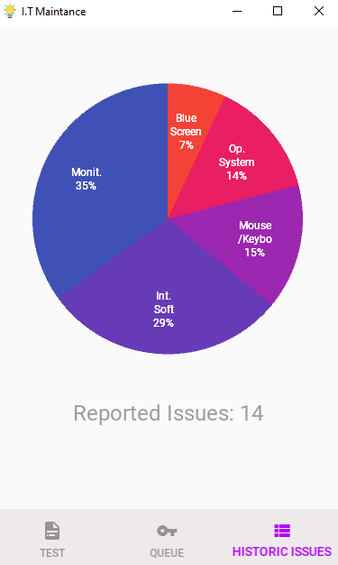

I.T Maintance
-------------


Android mobile application in Python to control the maintenance of computers in sectors of a company with real-time database -_Firebase._

----------------
The Project
-

The idea of this project is that the employees of a company can make maintenance requests when necessary.
In addition, they can follow the progress of calls within a screen called "Queue".

Each user registers with their name, email and company sector.
From there, it can execute a call and be recognized in the request queue.

The maintenance team has its own interface for the application, where it can create new categories of problems, test submissions and access the list of requests. In addition to monitoring case statistics in real time to assist in decision making.

Dependencies
=
See _requirements.txt_

Installation
=

This app was built using Google Colab.

### First Step
In a new notebook, load all the files and folders that will be used in the project as in the scheme below : 

  

### Second Step
After joining all the files, run the scripts below one by one

````commandline
!pip install buildozer
````

````commandline
!pip install cython==0.29.19
````

````commandline
!sudo apt-get install -y \
    python3-pip \
    build-essential \
    git \
    python3 \
    python3-dev \
    ffmpeg \
    libsdl2-dev \
    libsdl2-image-dev \
    libsdl2-mixer-dev \
    libsdl2-ttf-dev \
    libportmidi-dev \
    libswscale-dev \
    libavformat-dev \
    libavcodec-dev \
    zlib1g-dev
````

````commandline
!sudo apt-get install -y \
    libgstreamer1.0 \
    gstreamer1.0-plugins-base \
    gstreamer1.0-plugins-good
````

````commandline
!sudo apt-get install build-essential libsqlite3-dev sqlite3 bzip2 libbz2-dev zlib1g-dev libssl-dev openssl libgdbm-dev libgdbm-compat-dev liblzma-dev libreadline-dev libncursesw5-dev libffi-dev uuid-dev libffi6
````

````commandline
!sudo apt-get install libffi-dev
````

````commandline
!buildozer init
````
**Note**: after running *!buildozer init*, make sure the *buildozer.spec* file appears. If not, click the update files button in the files panel.

### Third Step
**Configuring buildozer.spec**

* Double click on the *buildozer.spec* file. On the opposite side of the screen, the settings of this file for editing will appear.

* Delete everything and paste the entire contents of the *buildoze.spec* file that is attached to this project.

* You can configure buildozer.spec in different ways according to your project. For more information visit: [https://buildozer.readthedocs.io/en/latest/](https://buildozer.readthedocs.io/en/latest/ "optional-title")

* After all this, run```!buildozer -v android debug```


When the whole process is finished, a folder called *bin* will be created and inside it will contain your *.apk* file ready to be sent to your Android device. Download the file and transfer it to your mobile device.




FIREBASE SETTINGS
==
- Register at [https://firebase.google.com/](https://firebase.google.com/ "optional-title") 
- Create a new project
- Follow the steps for configuration

After that, inside the console from Firebase:
- Set a new ``` Web``` application
- Register your app
- Click in ```Realtime Database``` on the left side of the console and ```Create Database```
- Follow the steps for configuration.

At this point your realtime database has been created. 

Go to ```Project Overview``` at the left side of the console and click on the gear icon. Select ```Project settings```.
In```General```tab, scroll down the page and search for the following items:
```
{
"apiKey": " project api key ",
"authDomain": " project authDomain ",
"databaseURL": " project databaseURL ",
"storageBucket": " project storageBucket "
}

```
*Note: If ``"databaseURL": " your project databaseURL "``does not appear, refresh the page and wait a few seconds.

Replace these values inside the _db.py_ file:
   ``` 
class LogData:
        def __init__(self):
            self.config = {
                "apiKey": " project api key ",
                "authDomain": " project authDomain ",
                "databaseURL": " project databaseURL ",
                "storageBucket": " project storageBucket ",
            }
```
From now on, your project is created, with a database connected.It still lacks the configuration of the rules of access to the database.

Firebase Rules of Database
=

Click on ```Realtime Database```at the left side of the console and choose ```Rules```tab.

Edit the rules to:
````
{
  "rules": {
    "users":{
       "$uid": {
        // Allow only authenticated content owners access to their data
        ".read":"auth != null && auth.uid == $uid",
        ".write":"auth != null && auth.uid == $uid"
        }
    },
    "issues":{
       ".read":"auth != null",
       ".write":"auth != null"
    },
            
    "requests":{
        ".read":"auth != null",
        ".write":"auth != null"
    },
         
     "requests_historic":{
        ".read":"auth != null",
        ".write":"auth != null"
    },
      
      "admin":{
        	// Allow only authenticated admin access to data
        	// set the email from de admin user'
        ".read":"auth != null && auth.token.email == 'name@mycompany.com' ",
        ".write":"auth != null && auth.token.email == 'name@mycompany.com' "
        }
    }        
}
````
**Note: To configure the app admin, change the ```auth.token.email == 'name@mycompany.com'``` from read and write to the email that will be the admin created in Authentication.****

For more information about firebase rules, see: [https://firebase.google.com/docs/database/security](https://firebase.google.com/docs/database/security "optional-title")

Your application is ready to run!


Screens
=

---

#### Client Side Screens

_Login_
-



_SignUp_
=


_Request Window_                                                                                                          
=                                                                                                                          

On this screen, the user points to which category of problem he requires assistance and details of what happened.  

                                                                   

Queue
=

Here, users can follow the progress of their requests



----

#### Admin I.T Side Screens

Config Area
=
In this part, the administrator can enter new issues, view the correct entry in the issues list, and do a test submission to make sure everything is working.

  

QUEUE
=
In this area, the administrator can see the requests and as he solves the problems, he can remove them from the queue. The database is automatically updated and users can follow the queue in real time.



Historic Issues
=

To assist in decision making, there is an area with problem statistics. Thus, it is possible to evaluate recurring problems, assess costs and prevent future problems.




Documentation
=
KivyMd

* See documentation at [https://kivymd.readthedocs.io](https://kivymd.readthedocs.io "optional-title")

Kivy
* See documentation at [https://kivy.org/doc/stable/](https://kivy.org/doc/stable/ "optional-title") 

License
=
KivyMD and kivy are released under the terms of the [MIT License](License/license "optional-title").

